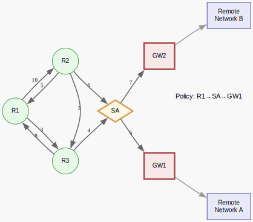

# Packet Passport

## What it does

Reads a directed, weighted graph representing routers inside an autonomous system and computes **forwarding tables** for every non-gateway router.

The key policy rules are:

- Every packet leaving the autonomous system must pass through a **security agent**.
- A **gateway cannot be used as an intermediate hop** on the way to the security agent.
- Once a packet leaves the security agent, the **first gateway reached** is the exit point.

The program prints, for each non-gateway router, a table of:

- `To` – gateway destination
- `Cost` – shortest policy-compliant distance
- `Next Hop` – where to send the packet next

## Solution

1. Read input from **standard input**:

- `n` (number of routers)
- An `n×n` adjacency matrix (use `-1` for ∞ / no link)
- A line of gateway IDs (sorted, non-empty)
- The security agent index

1. Build a directed weighted graph representation.
2. Run **Dijkstra's algorithm twice**:

- Once on the original graph to find distances to the security agent.
- Once on the **transposed graph** to derive "next hops" for forwarding tables.

1. For each non-gateway router, print a forwarding table:

- If the security agent is unreachable or no compliant path exists, entries are `-1`.

## How to run it

```sh
javac RouteToGateway.java
java RouteToGateway < test_input.txt
```

## Example

Below is a Graphviz visualization of a sample AS topology. The SVG shows the directed links and weights, and illustrates the policy requirement that every packet must pass through the security agent (SA) before reaching a gateway.



---
